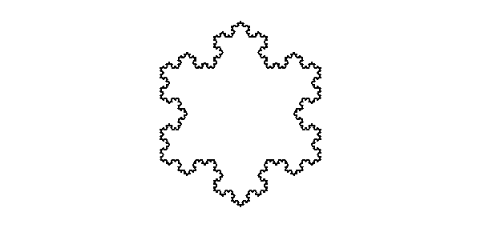

# KeiLisp-onWeb
（this document fix： 2020/01/03 create: 2020/01/03）<br>

## Reference
+ [Atom](./README_Atom.md)
+ [Cons](./README_Cons.md)
+ [Function](./README_Function.md)
+ [2D Graphic Function](./README_2DGraphic.md)

## Example
+ [Basic Functions](./README_Example.md#basic-funcitons-example)
+ [2D Graphic Functions](./README_Example.md#2d-graphic-functions-example)

### Basic Funcitons Example 
#### example1
```
>> 1
1
>> -1.2
-1.2
>> a
a
>> nil
nil
```

#### example2
```
>> ()
nil
>> (+ 1 2)
3
>> (+ 1 2.3)
3.3
>> (+ 1.2 3)
4.2
>> (+ 1.2 3.4)
4.6
>> (+ 1.2 -3.4)
-2.2
```

#### example3
```
>> '(1 . 2)
(1 . 2)
>> '(1 . 2.3)
(1 . 2.3)
>> '(1.2 . 3)
(1.2 . 3)
>> '(1.2 . 3.4)
(1.2 . 3.4)
>> '(1 . nil)
(1)
>> '(nil . 1)
(nil . 1)
>> '(1.2 nil)
(1.2)
>> '(nil 1.2)
(nil 1.2)
```

#### example4
```
>> (car '(1 (2 (3 (4 5) 6) 7 (8 9))))
1
>> (cdr '(1 (2 (3 (4 5) 6) 7 (8 9))))
((2 (3 (4 5) 6) 7 (8 9)))
>> (+ (- (* 1 2) (* 3 4)) (- (* 5 6) (* 7 8)))
-36
>> (+
     1
  2
      )(+ (- (* 1 2) (* 3 4)) (- (* 5 6) (* 7 8)))(
   -
   4
3

)
3
-36
1
```

#### example 5
```
>> (defun tasu (a b) (+ a b))
tasu
>> (tasu 7 8)
15
```

### Example 6 rotate
```
>> (defun rotate (x n) 
	(cond ((= n 0) x) 
		((> n 0) (rotate (append (cdr x) (cons (car x) nil)) (- n 1))) 
		((< n 0) (rotate x (+ (length x) n))) 
	) 
)
rotate
>> (rotate '(1 2 3 4 5 6 7 8 9) 2)
(3 4 5 6 7 8 9 1 2)
>> (rotate '(1 2 3 4 5 6 7 8 9) -3)
(7 8 9 1 2 3 4 5 6)
>> (rotate '(1 2 3 4 5 6 7 8 9) 9)
(1 2 3 4 5 6 7 8 9)
>> (rotate '(1 2 3 4 5 6 7 8 9) -18)
(1 2 3 4 5 6 7 8 9)
>> (rotate '(1 2 3 4 5 6 7 8 9) 0)
(1 2 3 4 5 6 7 8 9)
```

### Example7 flattern
```
>> (defun flatten (x) 
	(cond ((null x) nil)
		((atom x) (list x)) 
		(t (append (flatten (car x)) (flatten (cdr x)))) 
	) 
)
flatten
>> (flatten '(1 (2 (3 4) (5) (6 7) 8) 9))
(1 2 3 4 5 6 7 8 9)
>> (flatten '(a (b (c (d e))) f (g h) i))
(a b c d e f g h i)
>> (flatten '((1 . 2) ((3 4) . 5) 6))
(1 2 3 4 5 6)
>> (flatten '(((k (r s t u)) g (m)) c d ((n) (o (v w x y z) q))))
(k r s t u g m c d n o v w x y z q)
```

### 2D Graphic Functions Example
#### example1 rectangle
```
>> (gopen)
canvas size, width :600 height :300
t
>> (gfill-rect 100 100 100 100)
t
>> (gstroke-color "red")(gstroke-rect 300 100 50 50)
t
t
```


### example2 triangle
```
>> (gopen)
canvas size, width :600 height :300
t
>> (gfill-tri 100 100 50 150 150 150)
t
>> (gstroke-color "red")(gstroke-tri 250 100 200 150 300 150)
t
t
```


### example3 line
```
>> (gopen)
canvas size, width :600 height :300
t
>> (gstart-path)(gmove-to 50 50)(gline-to  550 50)(gfinish-path)(gstroke)
t
t
t
t
t
```


### example4 arc
```
>> (gopen)
canvas size, width :600 height :300
t
>> (gstart-path)(garc 300 150 50 0 360 0)(gstroke)
t
t
t
>> (gstart-path)(gmove-to 180 190)(garc-to 180 230 110 230 130)(gline-to 110 230)(gstroke)
t
t
t
t
t
```


### example5 Quadratic curve
```
>> (gopen)
canvas size, width :600 height :300
t
>> (gstart-path)
(gmove-to 75 25)
(gquadcurve-to 25 25 25 62.5)
(gquadcurve-to 25 100 50 100)
(gquadcurve-to 50 120 30 125)
(gquadcurve-to 60 120 65 100)
(gquadcurve-to 125 100 125 62.5)
(gquadcurve-to 125 25 75 25)
(gstroke)
t
t
t
t
t
t
t
t
t
```


### example6 Bezier curve
```
>> (gopen)
canvas size, width :600 height :300
t
>> (gcolor "pink")
t
>> (gstart-path)(gmove-to 75 40)
(gbezcurve-to 75 37 70 25 50 25)
(gbezcurve-to 20 25 20 62.5 20 62.5)
(gbezcurve-to 20 80 40 102 75 120)
(gbezcurve-to 110 102 130 80 130 62.5)
(gbezcurve-to 130 62.5 130 25 100 25)
(gbezcurve-to 85 25 75 37 75 40)
(gfill)
t
t
t
t
t
t
t
t
t
```


### example7 color
```
>> (gopen)
canvas size, width :600 height :300
t
>> (gfill-rect 10 10 30 30)(gfill-color "red")(gfill-rect 50 10 30 30)
t
t
>> (gstroke-rect 10 50 30 30)(gstroke-color "red")(gstroke-rect 50 50 30 30)
t
t
t
>> (gcolor "pink")(gfill-rect 10 90 30 30)(gstroke-rect 50 90 30 30)
t
t
t
```


### example8 alpha
```
>> (gopen)
canvas size, width :600 height :300
t
>> (gfill-color "red")(galpha 1)(gfill-rect 50 100 90 90)
t
t
t
>> (galpha 0.5)(gfill-rect 200 100 90 90)
t
t
>> (galpha 0)(gfill-rect 350 100 90 90)
t
t
```


### example9 line cap
```
>> (gopen)
canvas size, width :600 height :300
t
>> (gstart-path)(gline-width 15)(gmove-to 50 50)(gline-cap 0)(gline-to 50 250)(gstroke)
t
t
t
t
t
t
>> (gstart-path)(gline-width 15)(gmove-to 100 50)(gline-cap 1)(gline-to 100 250)(gstroke)
t
t
t
t
t
t
>> (gstart-path)(gline-width 15)(gmove-to 150 50)(gline-cap -1)(gline-to 150 250)(gstroke)
t
t
t
t
t
t
```


### example10 line-join
```
>> (gopen)
canvas size, width :600 height :300
t
>> (gstart-path)(gline-width 20)(gline-join 0)(gmove-to 50 50)(gline-to 100 100)(gline-to 50 150)(gline-to 100 200)(gstroke)
t
t
t
t
t
t
t
t
>> (gstart-path)(gline-width 20)(gline-join 1)(gmove-to 150 50)(gline-to 200 100)(gline-to 150 150)(gline-to 200 200)(gstroke)
t
t
t
t
t
t
t
t
>> (gstart-path)(gline-width 20)(gline-join -1)(gmove-to 250 50)(gline-to 300 100)(gline-to 250 150)(gline-to 300 200)(gstroke)
t
t
t
t
t
t
t
t
```


### example11 shadow
```
>> (gopen)
canvas size, width :600 height :300
t
>> (gshadow-color "red")(gshadow-offsetx 10)(gshadow-offsety 10)(gfill-rect 20 20 100 100)
t
t
t
t
>> (gline-width 6)(gstroke-rect 170 20 100 100)
t
t
>> (gshadow-blur 15)(gfill-color "blue")(gfill-rect 20 170 150 100)
t
t
t
```


### example12 text
```
>> (gopen)
canvas size, width :600 height :300
t
>> (gtext-font "48px serif")
t
>> (gfill-text "Hello World" 10 50)
t
>> (gstroke-text "Hello World" 10 100)
t
```


### example13 text font
```
>> (gopen)
canvas size, width :600 height :300
t
>> (gtext-font "48px serif")(gfill-text "京都 あい アイ 123 abc" 10 50)
t
t
>> (gtext-font "48px sans-serif")(gfill-text "京都 あい アイ 123 abc" 10 100)
t
t
>> (gtext-font "48px monospace")(gfill-text "京都 あい アイ 123 abc" 10 150)
t
t
>> (gtext-font "bold 48px serif")(gfill-text "京都 あい アイ 123 abc" 10 200)
t
t
>> (gtext-font "italic 48px serif")(gfill-text "京都 あい アイ 123 abc" 10 250)
t
t
```


### example14 text align
```
>> (gopen)
canvas size, width :600 height :300
t
>> (gtext-font "48px serif")
t
>> (gtext-align "left")(gfill-text "left" 300 50)
t
t
>> (gtext-align "center")(gfill-text "center" 300 100)
t
t
>> (gtext-align "right")(gfill-text "right" 300 150)
t
t
```


### example15 text direction
```
>> (gopen)
canvas size, width :600 height :300
t
>> (gtext-font "48px serif")
t
>>(gtext-dire 0)(gfill-text "Hello World" 300 50)
t
t
>> (gtext-dire 1)(gfill-text "Hello World" 300 100)
t
t
>> (gtext-dire -1)(gfill-text "Hello World" 300 150)
t
t
```


### example16 text line
```
>> (gopen)
canvas size, width :600 height :300
t
>> (setq y 30)(gtext-font "30px serif")
t
t
>> (dolist (each '("top" "hanging" "middle" "alphabetic" "ideographic" "bottom") t) 
	(gstart-path)
	(gmove-to 0 y)
	(gline-to 550 y)
	(gstroke)
	(gtext-line each)
	(gfill-text each 0 y)
	(setq y (+ y 50))
)
t
```


### example17 translate
```
>> (gopen)
canvas size, width :600 height :300
t
>> (gfill-rect 0 0 100 100)(gtranslate 200 200)(gfill-rect 0 0 100 100)
t
t
t
```


### example18 rotate
```
>> (gopen)
canvas size, width :600 height :300
t
>> (gcolor "blue")(gfill-rect 100 100 100 100)(grotate 30)(gcolor "red")(gfill-rect 100 100 100 100)
t
t
t
t
t
```


### example19 scale
```
>> (gopen)
canvas size, width :600 height :300
t
>> (gfill-rect 1 1 10 10)(gscale 5 10)(gcolor "red")(gfill-rect 10 10 10 10)
t
t
t
t
```


### example20 Koch curve
```
>> (gopen)
canvas size, width :600 height :300
t
>> (defun add-line (x1 y1 x2 y2) 
	(progn ((gstart-path))
			(gmove-to x1 y1)
			(gline-to x2 y2)
			(gfinish-path)
			(gstroke)
	)
)
t
>> (defun draw-koch (x1 y1 x5 y5 dimension angle)
	(cond
		((= dimension 0) (add-line x1 y1 x5 y5))
		(t 
			(setq len (/ (sqrt (+ (* (- x1 x5) (- x1 x5)) (* (- y1 y5) (- y1 y5)))) 3))
			(setq x2 (+ x1 (* len (cos angle))))
			(setq y2 (+ y1 (* len (sin angle))))
			(add-line x1 y1 x2 y2)
			(setq x3 (+ x2 (* len (cos (+ angle (/ (pi) 3))))))
			(setq y3 (+ y2 (* len (sin (+ angle (/ (pi) 3))))))
			(draw-koch x2 y2 x3 y3 (- dimension 1) (+ angle (/ (pi) 3)))
			(setq x4 (+ x3 (* len (cos (- angle (/ (pi) 3))))))
			(setq y4 (+ y3 (* len (sin (- angle (/ (pi) 3))))))
			(draw-koch x3 y3 x4 y4 (- dimension 1) (- angle (/ (pi) 3)))
			(add-line x4 y4 x5 y5)
		)
	)
)
t 
>> (draw-koch 100 100 500 100 4 0)
t
```


### example21 
```
>> (gopen)
canvas size, width :600 height :300
t
>> (defun add-line (x1 y1 x2 y2) 
	(progn ((gstart-path))
			(gmove-to x1 y1)
			(gline-to x2 y2)
			(gfinish-path)
			(gstroke)
	)
)
t
>> (defun draw-koch (x1 y1 x5 y5 dimension)
	(cond
		((= dimension 0) (add-line x1 y1 x5 y5))
		(t 	
			(setq x2 (+ (* 2 (/ x1 3)) (/ x5 3)))
			(setq y2 (+ (* 2 (/ y1 3)) (/ y5 3)))
			(setq x3 (+ (/ x1 3) (* 2 (/ x5 3))))
			(setq y3 (+ (/ y1 3) (* 2 (/ y5 3))))
			(setq x4 (+ (- (* (- x3 x2) (cos (/ (pi) 3))) (* (- y3 y2) (sin (/ (pi) 3)))) x2))
			(setq y4 (+ (+ (* (- x3 x2) (sin (/ (pi) 3))) (* (- y3 y2) (cos (/ (pi) 3)))) y2))
			(draw-koch x1 y1 x2 y2 (- dimension 1))
			(draw-koch x2 y2 x4 y4 (- dimension 1))
			(draw-koch x4 y4 x3 y3 (- dimension 1))
			(draw-koch x3 y3 x5 y5 (- dimension 1))
		)
	)
)
t
>> (draw-koch 200 200 400 200 4)
t
>> (draw-koch 400 200 300 27 4)
t
>> (draw-koch 300 27 200 200 4)
```

